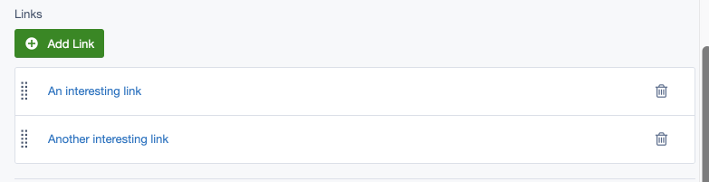
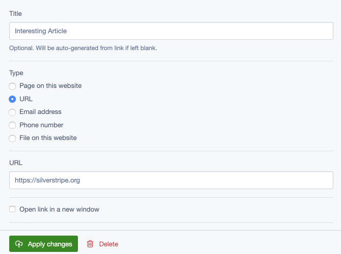

# Silverstripe linkfield

Adds a Linkfield for [gorriecoe/silverstripe-link](https://github.com/gorriecoe/silverstripe-link)

## Installation
Composer is the recommended way of installing SilverStripe modules.
```
composer require gorriecoe/silverstripe-linkfield
```

## Requirements

- gorriecoe/silverstripe-link ^1.0
- silvershop/silverstripe-hasonefield 3.0.1. [See Issue #11](https://github.com/gorriecoe/silverstripe-linkfield/issues/11#issuecomment-497077936)
- symbiote/silverstripe-gridfieldextensions 3.1

## Maintainers

- [Gorrie Coe](https://github.com/gorriecoe)
- [Elliot Sawyer](https://github.com/elliot-sawyer)

## Screenshots




## Usage

```php
<?php

use gorriecoe\Link\Models\Link;
use gorriecoe\LinkField\LinkField;

class MyClass extends DataObject
{
    private static $has_one = [
        'Button' => Link::class
    ];

    private static $many_many = [
        'Buttons' => Link::class
    ];

    private static $many_many_extraFields = [
        'Buttons' => [
            'Sort' => 'Int' // Required for all many_many relationships
        ]
    ];

    /**
     * CMS Fields
     * @return FieldList
     */
    public function getCMSFields()
    {
        $fields = parent::getCMSFields();
        $fields->addFieldsToTab(
            'Root.Main',
            [
                LinkField::create(
                    'Button',
                    'Button',
                    $this
                ),
                LinkField::create(
                    'Buttons',
                    'Buttons',
                    $this
                )
            ]
        );
        return $fields;
    }
}
```

### Configuration

By default all link types allowed in the Link model are displayed in the edit form, but this can be configured per-field, allowing multiple configurations without requiring multiple otherwise-identical Link model subclasses.

The Title field can also be hidden, which is useful if you intend on using the URL for a link but not the user-configured Title.

This configuration can be passed into the constructor, or set later using the `` method.

#### Declare only which link types _are_ allowed.
```php
// Allow only SiteTree and URL types, implicitly allow displaying title field.
$linkConfig = [
    'types' => [
        'SiteTree',
        'URL',
    ],
];
LinkField::create($this, 'FieldName', 'Field Title', $linkConfig);
```

#### Explicitly declare whether each type of link is allowed or not.
```php
// Allow only SiteTree and URL types.
$linkConfig = [
    'types' => [
        'SiteTree' => TRUE,
        'URL' => TRUE,
        'Email' => FALSE,
        'Phone' => FALSE,
        'File' => FALSE,
    ],
];
LinkField::create($this, 'FieldName', 'Field Title', $linkConfig);
```

#### Hide the Title field
```php
$linkConfig = [
    'title_display' => false,
];
LinkField::create($this, 'FieldName', 'Field Title', $linkConfig);
```

#### Setting the configuration later
```php
$linkField = LinkField::create($this, 'FieldName');
$linkConfig = [
    'types' => [
        'SiteTree',
        'URL',
    ],
];
$linkField->setLinkConfig($linkConfig);
```

## Sort column

By default the LinkField assumes that the sort column is named `Sort`. If you want to use another field name such as `SortOrder`, you can specify it using the `setSortColumn` method like so:

```php
LinkField::create(
    'Buttons',
    'Buttons',
    $this
)->setSortColumn('SortOrder')
```

You can also globally define the sort column. In your config.yml add the following:

```yml
gorriecoe\LinkField\LinkField:
  sort_column: 'SortOrder'
```

## Belongs many many

We can also add a belongs_many_many relation to the Link class. In your config.yml add the following:

```yml
gorriecoe\Link\Models\Link:
  belongs_many_many:
    MyCustomObject : MyCustomObject.Buttons
```
